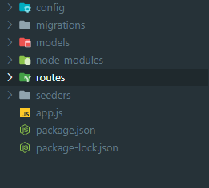

# Sequelize기본 셋팅

Sequelize를 사용해 회원가입 기능을 먼저 구현해 볼 것입니다. 

### Router

일단 모듈화를 위해 Router를 만들어 줄것입니다. /user uri를 통해 받아올 것이기 때문에 

routes/user.js를 만들어준뒤 app.js에서 설정해주세요

```javascript
//   routes/user.js
const express = require("express");

const router = express.Router();

router.post("/signup", (req, res) => {
  res.send("회원가입");
});

module.exports = router;
```

```javascript
//   app.js
const express = require("express");
const userRouter = require("./routes/user");

const app = express();
const PORT = 3030;

app.get("/", (req, res) => {
  res.send("페이지");
});

app.use("/user", userRouter);

app.listen(PORT, () => {
  console.log(PORT, "에서 서버실행중");
});
```

이제 sequelize를 설정해 줄것입니다. 

sequelize와 sequelize-cli , mysql2를 다운받으세요

```javascript
npm i sequelize sequelize-cli mysql2
```

그 뒤로 `npx sequelize init`을 해주면 자동으로 폴더구조가 생성됩니다. 



우선 config폴더안에서 기본 설정을 해줄 것입니다. 

### dotenv

보안을 위해 dotenv를 설치해주세요 

루트 디렉토리 안에 .env파일을 생성한뒤 다음과 같은 정보를 적어준다음 잘 관리해주세요

```javascript
DB_PASSWORD= 비밀번호
```

이제 config.json파일을 config.js파일로 바꿔준뒤 정보를 입력합니다. .env는 다음과 같이 사용할 수 있습니다.   

app.js에서 dotenv를 config해주고

```javascript
const express = require("express");
const userRouter = require("./routes/user");
const dotenv = require("dotenv");

const app = express();
const PORT = 3030;

dotenv.config();

app.get("/", (req, res) => {
  res.send("페이지");
});

app.use("/user", userRouter);

app.listen(PORT, () => {
  console.log(PORT, "에서 서버실행중");
});
```

config.json에서도 다음과 같이 해줍니다.

```javascript
const dotenv = require("dotenv");

dotenv.config();

module.exports = {
  development: {
    username: "root",
    password: process.env.DB_PASSWORD,
    database: "database_development",
    host: "127.0.0.1",
    dialect: "mysql",
  },
  test: {
    username: "root",
    password: null,
    database: "database_test",
    host: "127.0.0.1",
    dialect: "mysql",
  },
  production: {
    username: "root",
    password: null,
    database: "database_production",
    host: "127.0.0.1",
    dialect: "mysql",
  },
};
```

.env에서 설정한 내용은 `process.env.`안에서 불러올 수 있습니다. 

이제 본격적인 sequelize를 설정해볼 준비가 되었습니다. 

다음장으로 고고

